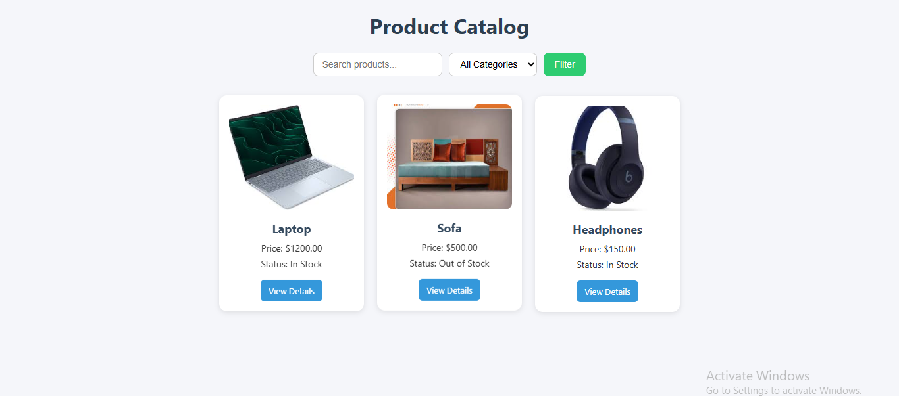
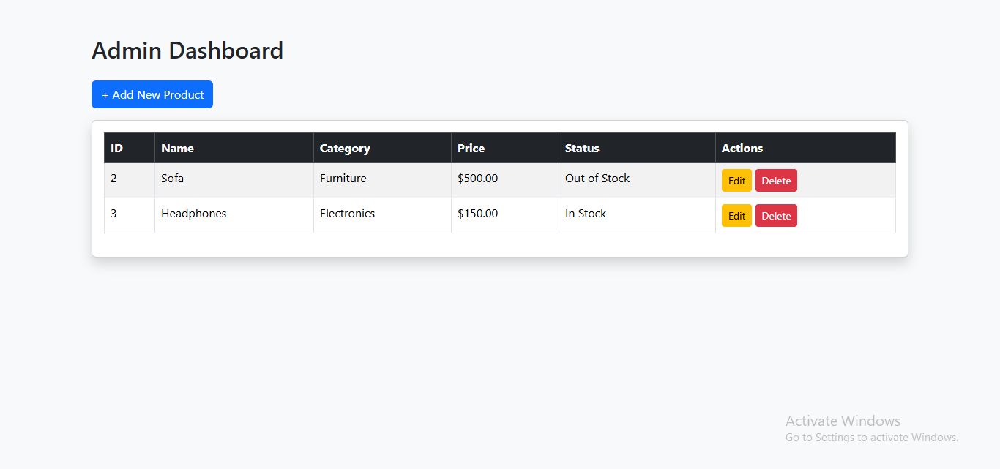
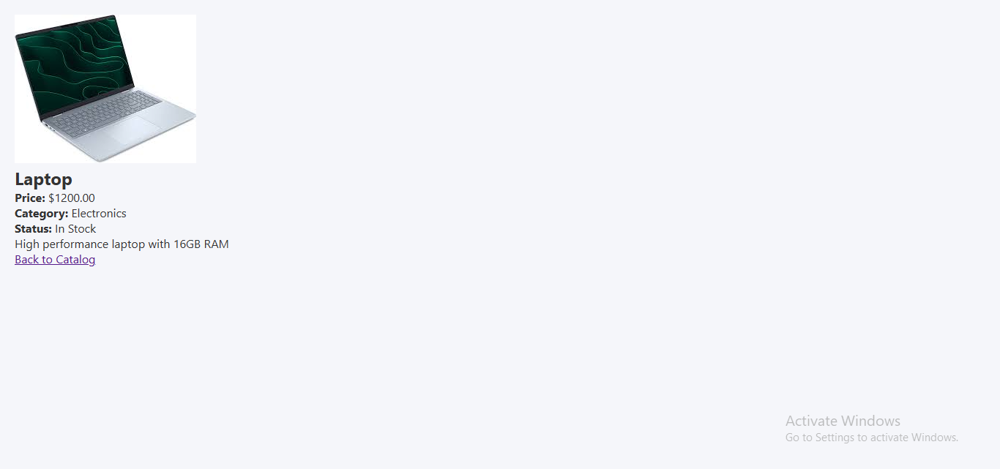

# Product Catalog

A **Product Catalog** project built with PHP and MySQL.  
This project includes a frontend for users to view products and an admin panel to manage products (add, edit, delete).  

---

## Frontend Pages

- **Homepage** – Displays all products with images and details  
- **Product Detail Page** – Shows detailed information about a selected product  

---

## Admin Panel

- **Dashboard** – Admin overview  
- **Add Product** – Add new products  
- **Edit Product** – Edit existing products  
- **Delete Product** – Remove products from the catalog  
  
  


---

## Files Overview

| File/Folder                  | Description                                      |
|-------------------------------|-------------------------------------------------|
| `index.php`                  | Frontend homepage                                |
| `product_detail.php`         | Product detail page                              |
| `db.php`                     | Database connection file                         |
| `admin/`                     | Admin panel files (dashboard, add/edit/delete)  |
| `css/`                       | Stylesheets for frontend and admin panel        |
| `images/`                    | Product images                                   |
| `product_catalog_db`              | Database export file                             |
| `screenshots/`               | Screenshots for README display                   |

---

## Requirements

- XAMPP (Apache + MySQL)  
- PHP 8.x or above  
- MySQL  

---

## Setup Instructions

1. **Clone or download** this repository to your local machine.  
2. **Copy project folder** to XAMPP's `htdocs` (e.g., `E:\xampp8.2\htdocs\Product_catalog`).  
3. **Start Apache & MySQL** from XAMPP Control Panel.  
4. **Create a database** in phpMyAdmin.  
5. **Import the database**:  
   - Open phpMyAdmin → select your database → Import → Choose `127_0_0_1.sql`  
   - Click Go  
6. **Update database credentials** in `db.php` if necessary:  

```php
$host = "localhost";
$user = "root";
$pass = "";
$db   = "your_database_name";
